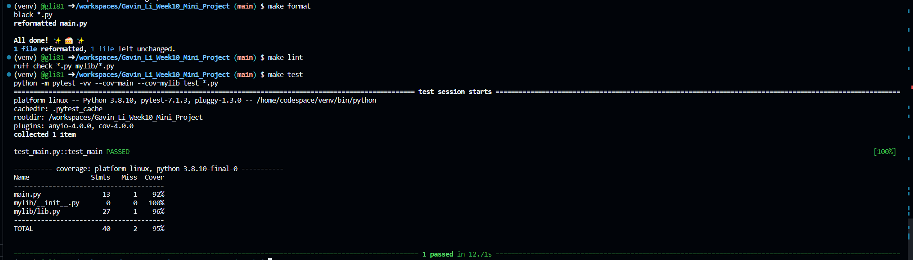
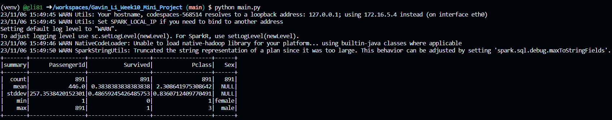
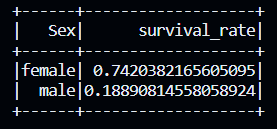

[](https://github.com/nogibjj/Gavin_Li_Week10_Mini_Project/actions/workflows/cicd.yml)
#

# IDS 706 Data Engineering Week 10 Mini Project

Gavin Li `gl183`

## Purpose of the project

The purpose of this week's mini project is to perform ETL (Extract - Transform - Load) to a dataset.

Then display a summary of the data and a query result of the data both using PySpark and SparkSQL.

## Result of `make format`, `make lint`, and `make test`



## ETL functionality

[E]xtraction - Retrieved a dataset from online source by sending GET request, and stored the data in a csv file.

[T]ransform - Transformed the dataset by dropping unrelevant variables, and write back to the csv file.

[L]oad - Load the transformed data to Spark using PySpark API.

## Summary of the data

Here is a summary of the loaded data



## Query

I calculated the survival rate for different gender using the SQL query below:

```sql
SELECT
    Sex,
    AVG(Survived) AS survival_rate
FROM table
GROUP BY Sex
```

and here is the result:



## References

[Professor Noah's Python Template](https://github.com/nogibjj/python-ruff-template/assets/58792/f7f33cd3-cff5-4014-98ea-09b6a29c7557)


